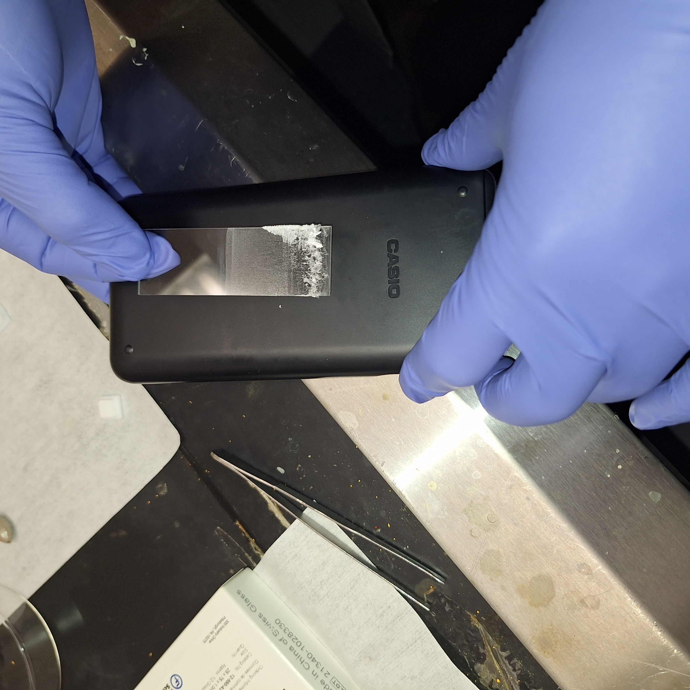
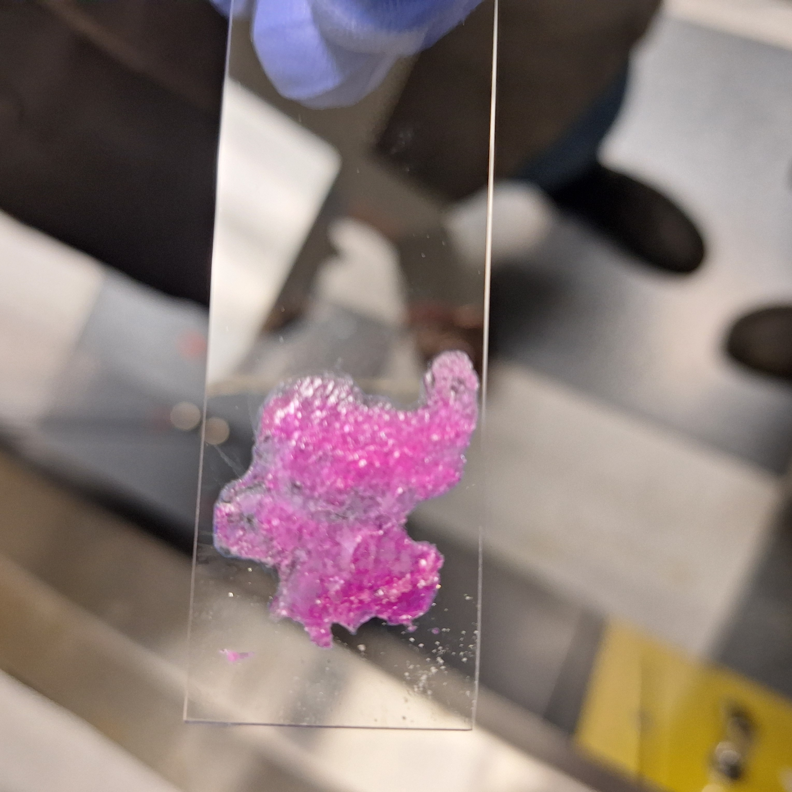
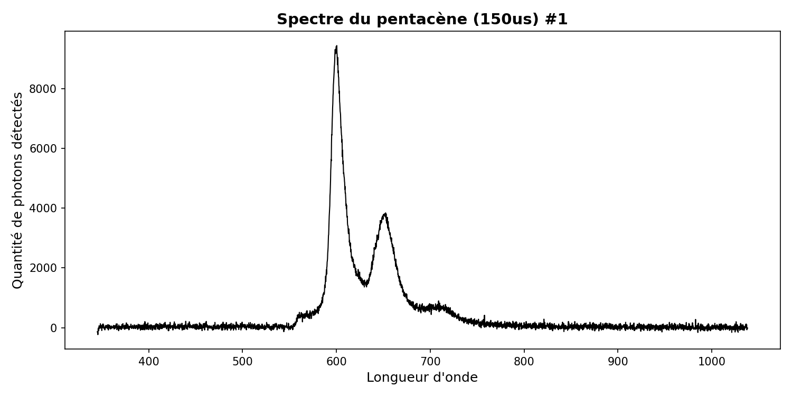
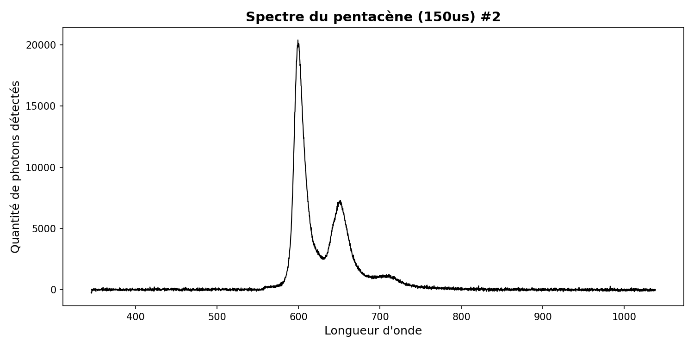
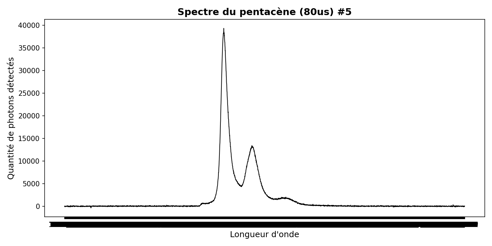

### stage-odmr
Le but de ce projet est d'utiliser des cristaux organiques pour prendre des mesures précises de champs magnétiques, de micro-ondes, etc. Les cristaux utiliser peuvent décroitres dans un état triplet permettant un contrôle cohérent des populations (T_x, T_y, T_z). Les temps de décroissance varient et permettent de moduler la photoluminescence (PL). 

## Installation 
```bash
git clone https://github.com/Arsene-Leblanc/stage-odmr.git
cd stage-odmr
```

### Stade 1 : croissance des cristaux
Nous utilisons des cristaux de P-Terphényle (PTP) dopés avec du pentacène (PC) comme base pour nos expériences. Le substrat est du verre, nous utilisons des lamelles de microscope ainsi que des substrats carrés en verre. Le PTP est mis en solution dans de l'acétate d'éthyle et agité pendant une vingtaine de minute. Les deux concentration fonctionnant le mieux pour l'instant sont 1mg/mL et 2mg/mL. Le PC est quant à lui dissous *difficilement* dans du dichlorobenzène. Il semple que la présence de groupements chlorés est bénéfique pour sa dissolution. On chauffe ensuite jusqu'à environ 45 degrées C, avec une agitationt très forte (1600 rpm).On arrive à dissoudre une partie du 1mg dans 20mL. Une partie de cette solution est diluée dans la solution de PTP. 
Il suffit alors de mettre nos lames et lamelles dans des béchers et de laisser la solution s'évaporer. Après 24-72h on se retouvre avec des cristaux à la base des substrats. 

Nos premiers cristaux ont été difficiles à faire croitre, toutefois, nous arrivons dorénavant à avoir d'assez bons résultats répétivement. Voici à quoi ressemble nos cristaux en général (à changer) :


#### Update ! 29 juin 2026
Nous avons testé récemmenent une nouvelle méthode pour produire des cristaux avec une meilleure concentration en pentacène. Pour ce faire, 300mg de PTP on été mélangé avec 0.3mg de PC sous forme solide (poudre). Une lame de microscope a été chauffé dans une boite de petri en verre jusqu'à 350 degré Celcius. Une fois cette température atteinte, nous savions que le P-Terphényle allait fondre (212-214 degrés comme température de fusion), et que le pentacène allait lui aussi fondre dans ce mélange (>300 degree, mais sublime à 372C). Pour de futurs essais il serait pertinent de tester à des températures plus basse, proche de la température de fusion du PTP. Le pentacène aurait possiblement la capacité de se dissoudre dedans. Une fois la lame à température désirée, il suffit de déposer la poudre, laisser quelques secondes au PTP de fondre, puis lors de l'apparition d'une couleur mauve/magenta, il est nécessaire de déplacer l'amas de poudre sur la lame, cela étale le liquide. Rapidement, il faut baisser la température. Effectivement, la pression vapeur du PTP est assez élevée à cette température et il est possible de voir la masse diminuer significativement si l'on laisse trop longtemps chauffer le PTP. Le résultat final est un cristal magenta sur la lame, polycristallin, d'une épaisseur que nous estimons à quelques dixièmes de milimètre.

 
### Stade 2 : Mesure de la photoluminescence et du spectre en régime continu
Pour tester nos échantillons, nous avons mis en place un simple montage optique. Il est composé d'un LASER vert dde 505nm et de puissance <5mW. Il vise l'échantillon qui est soutenue par une petite pince. La lumière émise par PL est convergée par une lentille de f=25mm puis un filtre (550nm) empêche notre LASER de polluer la mesure. Au bout, une fibre optique de 10um² capte la PL et se rend dans un spectromètre qui analyse notre spectre d'émission.

### Résultats du spectre de la photoluminescence
Comme nous sommes encore au tout début de notre projet, il est à noter que nos cristaux sont très inégaux et que certains échantillons performent bien mieux que d'autres. Toutefois, nos résultats s'améliorent de manière relativement constante. Voici quelques spectres prit en ordre chronologique du projet. Les temps d'intégration sont les même pour tous les échantillons(150&mu; s) sauf le plus récent qui est de 80&mu; s puisqu'il saturait le détecteur sinon. 




### Stade 3 : Mesure du PLQY (photoluminescence quantum yield)
(10-06-2026) Dans le cadre de notre recherche, il est pertinent de connaître le PLQY de nos échantillons. C'est à dire le pourcentage de photons émis en comparaison au nombre de photons absorbés. Cette caractéristique définie en quelque sorte la qualité de la fluorescence de notre échantillon. Pour cette mesure, il est important d'avoir un échantillon petit et de qualité. Nous avons donc coupé des lames de verre et essayer de déposer efficacement des cristaux de PTP dopés au PC sur ceux-ci. Toutefois, le premier essai fut un échec, aucun pentacène ne fut détecté. Ce résultat étrange n'est pas une première et nous cherchons toujours la raison expliquant ce phénomène. Parfois, on dirait simplement que le cristal de PTP n'a aucun pentacène. 

### Stade 4 : Modulation de la luminescence par micro-onde
La suite logique des expériences de tester la modulation de la PL de nos échantillons en l'excitant avec des micro-ondes. Un montage avec a été réalisé avec 2 Lock-in Amplifier, un oscilloscope et un Analogue Signal Generator. 
L'antenne utilisée pour l'instant est un mince fil de cuivre formant une boucle. On module les ondes radios (AM/FM) et procédons à une prise de mesure avec plusieurs milliers de pas en utilisant la fonction SWEEP de l'appareil. Le trigger est une entrée digitale à l'arrière de l'appareil que toute carte d'acquisition peut contrôler. Le premier Lock-in isole la fréquence de 500 Hz du chopper, le deuxième cherche la fréquence de modulationn des micro ondes.  
