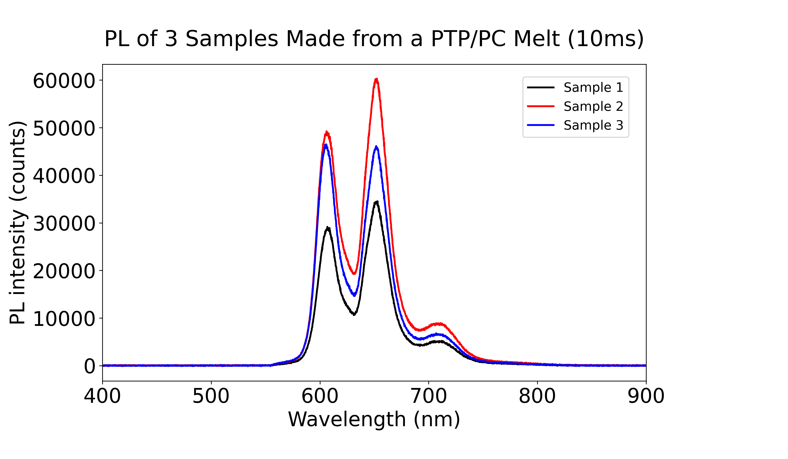

### 2026/06/17

First attempts with a new sample preparation method. The method consists in melting PTP directly, adding 0.1% (solid) pentacene. Temperature can then be raised above the pentacene metling point too, or it is also possible to try to dissolve the pentacene in the PTP melt(by stirring) without melting it itself. We then try to collect the resulting melt between 2 lamelles by capillarity. We did see some of the pentacene dissolve/mix into some pockets of PTP:

/06-17-Crystaux_produits.jpg)

One problem of the method is that there is a strong tendency for PTP to crystalize, especially on the corners of the beaker, as seen in the photo below:

/06-17-Setup.jpg)

Here it doesn't help that the bottom of the beaker is in oval shape, with gravity tending to bring any melt near the corners. Another problem is that some PTP is also turning into vapour, which then condensates e.g. near colder surfaces and either crystalize on the surfaces or rains down in crystal form(the grains acting as potential seeds). When the lamelle is inserted(even after gradual heating of the lamelles), some PTP vapour also crystalizes on the lamelle but without pentacene.

/06-17-Double\_Lamelle.jpg)

Here the tip of one lamelle was seen to detach. The possible culprits are:

\-Thermal shocks

\-The glass becoming easier to break with higher temperatures.

\-Some of the PTP melt infiltrated the lamelle through e.g. cracks. 

The ''missing'' tip is shown below, where it is clearly seen that PTP crystals with higher concentration of pentacene agglomerated on it. 

/06-17-Partie\_brisée\_lamelle.jpg)

One last thing is that with higher temperature, either PTP or (more probably) the pentacene can react with oxygen in the air and degrade. This explains the brownish/orange colour on the agglomerations of crystal and broken parts of the lamelles.

### 2026/06/18

From the agglomerations of crystal with purple/rose colour, 3 were taken, glued either on a lamelle or on a pinhead and tested for PL with our setup, using the spectrometer and the LIA and the chopper. For example, here is sample 2:

/06-18-Sample2.jpg)

On the spectrometer and with 10ms integration time, the emission spectrum of the 3 samples is the following:

It is noted that the ratio of peaks is quite different from that of the previous samples. One reason may be that we are picking up PL from the degraded forms of pentacene. The LIA(locked in at a frequency of around 300Hz with the chopper) yielded a signal of 0.5V. On both accounts(LIA and spectrometer), the PL intensity measured surpasses by far that of the samples previously measured. Here is the spot of fluorescence observed at the end of the optical path:

/06-18-Sample2-PL.jpg)

The photoluminescence was also intense enough to be visible even with the lights on in the room.

Clearly the method is promising but there are some issues: first, the samples are not monocrystaline and rather opaque. Therefore most of the time we should be seing PL from near the surface of the sample, and most of the sample is wasted. Second, the degraded forms of pentacene, along with a bigger lack of uniformity in the sample(resulting e.g. from a polycristaline structure) should impact its coherence. There may be a way to obtain a better crystal structure with the method. Third we have yet to figure out a better way to collect the crystals forming from the melt. This involves having a better handle over it.

### 2026/06/25

A new method of fabrication was used to create a sample. The method is a variation of the melt method used previously. First a lamelle is pre-heated gradualy(to avoid thermal shocks) in a large beaker at around 300-350 C, and then the powder of PTP with 0.1% PC is melted and crystalized in place on the lamelle. Upon stirring and cooling of the resulting mixture of melt/crystals,  the following sample was obtained:

/06-25-Sample.jpg)

The PL of the sample was good as can be seen from the following picture:

/06-25-Sample-PL.jpg)

The method seems to be solving the issues we had with the melt method. Furthermore, it allows to create samples rather quickly(around 20-40 min).

